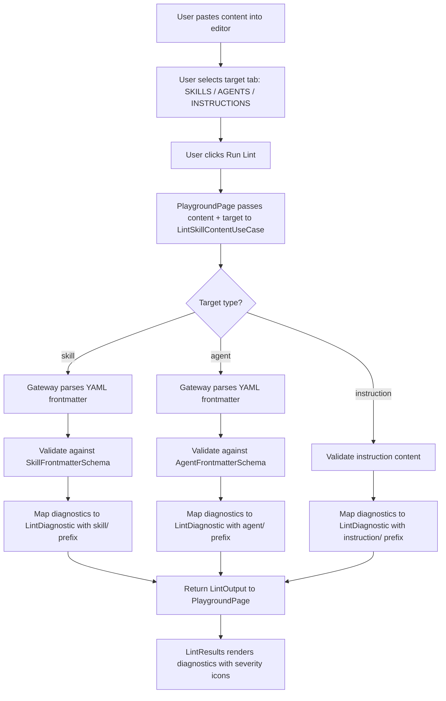
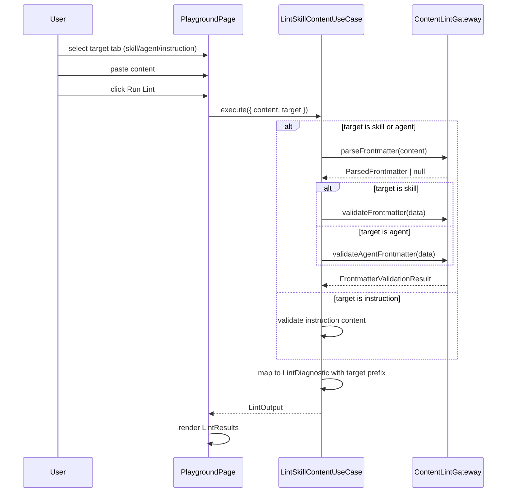

# Feature: Lint Playground

## Problem Statement

Developers exploring the Lousy Agents ecosystem have no interactive way to test skill linting without installing the CLI locally. A browser-based lint playground would let users paste skill markdown, run the linter, and see diagnostics instantly — lowering the barrier to understanding how skill frontmatter validation works and accelerating adoption.

## Personas

| Persona | Impact | Notes |
| --- | --- | --- |
| New User | Positive | Can try skill linting without installing the CLI |
| Developer with AI experience | Positive | Quick feedback loop for iterating on skill definitions |

## Value Assessment

- **Primary value**: Customer — reduces time-to-understanding for skill authoring conventions
- **Secondary value**: Market — interactive playground differentiates from static documentation

## User Stories

### Story 1: Playground navigation link

As a **developer**,
I want **to see a "Playground" link in the site navigation**,
so that I can **discover and access the interactive lint playground**.

#### Acceptance Criteria

- [x] When a user views the site header, the navigation shall display a "Playground" link.
- [x] When a user clicks the "Playground" link, the system shall navigate to `/playground`.
- [x] While a user is on `/playground`, the navigation shall mark the "Playground" link as active.
- [x] When a user opens the mobile navigation drawer, the drawer shall include a "Playground" link.

### Story 2: Lint playground empty state

As a **developer**,
I want **to see an empty playground with a skill markdown editor and clear instructions**,
so that I can **understand how to use the lint feature before pasting content**.

#### Acceptance Criteria

- [x] When a user navigates to `/playground`, the system shall display a text editor area for skill markdown input.
- [x] While the editor is empty, the system shall display placeholder text explaining the expected input format.
- [x] When a user views the playground, the system shall display a "Run Lint" button.
- [x] While no lint has been run, the system shall display an empty results area.

### Story 3: Running skill lint and viewing diagnostics

As a **developer**,
I want **to paste skill markdown and run the linter to see diagnostic results**,
so that I can **validate my skill frontmatter without installing the CLI**.

#### Acceptance Criteria

- [x] When a user pastes skill markdown and clicks "Run Lint", the system shall parse the frontmatter and display lint diagnostics.
- [x] When lint produces errors, the system shall display each error with severity, message, and line number.
- [x] When lint produces warnings, the system shall display each warning with severity, message, and line number.
- [x] When lint produces no diagnostics, the system shall display a success message.
- [x] When lint encounters invalid YAML frontmatter, the system shall display an appropriate error diagnostic.
- [x] The lint results shall display a summary with total files, errors, and warnings counts.

### Story 4: Use @lousy-agents/lint types for lint output

As a **developer**,
I want **the lint playground to produce output using the same types as the `@lousy-agents/lint` package**,
so that I can **trust the playground results are consistent with the CLI tool's output format**.

#### Acceptance Criteria

- [x] When the playground runs lint, the output shall conform to the `LintOutput` type from `@lousy-agents/lint`.
- [x] When the playground produces a diagnostic, it shall conform to the `LintDiagnostic` type from `@lousy-agents/lint`.
- [x] The playground shall set `target: "skill"` on all skill lint output.
- [x] The playground summary shall include `totalInfos` alongside `totalErrors` and `totalWarnings`.

### Story 5: Lint agents and instructions in addition to skills

As a **developer**,
I want **to paste agent or instruction markdown into the playground and see lint feedback**,
so that I can **validate all three content types without installing the CLI**.

#### Acceptance Criteria

- [x] When a user views the playground, the system shall display clickable tabs for SKILLS, AGENTS, and INSTRUCTIONS.
- [x] When a user clicks a target tab, the system shall update the active target and reset any previous lint results.
- [x] When a user pastes agent markdown and clicks "Run Lint" with the AGENTS tab selected, the system shall validate agent frontmatter (name, description) and display agent-prefixed diagnostics.
- [x] When agent frontmatter uses uppercase letters in the name field, the system shall accept it as valid (agents allow `^[a-zA-Z0-9][a-zA-Z0-9._-]*$`).
- [x] When a user pastes instruction markdown and clicks "Run Lint" with the INSTRUCTIONS tab selected, the system shall return lint output with target set to "instruction".
- [x] If the instruction content is empty, the system shall display a warning about empty content.
- [x] When the playground produces a diagnostic, the `target` field shall match the selected tab (skill, agent, or instruction).
- [x] When the playground produces a diagnostic, the `ruleId` shall use the correct target prefix (e.g., `agent/missing-frontmatter`, `instruction/empty-content`).

---

## Design

### Components Affected

- `src/components/layout/SiteHeader.tsx` — Add "Playground" to navLinks
- `src/components/layout/MobileNavDrawer.tsx` — Add "Playground" to navLinks
- `src/entities/skill-lint.ts` — Re-exports lint types from `@lousy-agents/lint` (`LintDiagnostic`, `LintOutput`, `LintSeverity`, `LintTarget`)
- `src/use-cases/lint-skill-content.ts` — Use case for linting skill markdown content from text
- `src/gateways/skill-content-lint-gateway.ts` — Browser-compatible gateway for parsing frontmatter from text
- `src/components/playground/PlaygroundPage.tsx` — Main playground page component
- `src/components/playground/SkillEditor.tsx` — Textarea/editor component for skill markdown
- `src/components/playground/LintResults.tsx` — Diagnostic results display component
- `src/pages/playground.astro` — Astro page mounting the playground island

### Dependencies

- `zod` — Already in project, used for frontmatter schema validation
- `yaml` — Needed for YAML frontmatter parsing in browser (existing dependency)
- `@lousy-agents/lint` v5.11.0 — Source of truth for lint output types (`LintDiagnostic`, `LintOutput`, `LintSeverity`, `LintTarget`); used via `import type` only since runtime code requires Node.js filesystem APIs. v5.11.0 adds `lintContent` API specification for future browser-compatible runtime integration.

### Data Flow

### Sequence Diagram

### Open Questions

- None — all required lint logic can be extracted from `@lousy-agents/core` entities and use cases.

---

## Tasks

> Each task should be completable in a single coding agent session.
> Tasks are sequenced by dependency. Complete in order unless noted.

### Task 1: Add Playground navigation link

**Objective**: Add "Playground" to the site header and mobile drawer navigation.

**Context**: The nav links are defined as arrays in SiteHeader.tsx and MobileNavDrawer.tsx.

**Affected files**:
- `src/components/layout/SiteHeader.tsx`
- `src/components/layout/MobileNavDrawer.tsx`
- `tests/components/layout/SiteHeader.test.tsx`
- `tests/components/layout/MobileNavDrawer.test.tsx`

**Requirements**:
- When a user views the site header, the navigation shall display a "Playground" link.
- When a user clicks the "Playground" link, the system shall navigate to `/playground`.
- While a user is on `/playground`, the navigation shall mark the "Playground" link as active.
- When a user opens the mobile navigation drawer, the drawer shall include a "Playground" link.

**Verification**:
- [x] `npm test` passes
- [x] `npx biome check` passes
- [x] Playground link appears in both desktop and mobile navigation

**Done when**:
- [x] All verification steps pass
- [x] No new errors in affected files

---

### Task 2: Create browser-compatible skill lint entities and use case

**Objective**: Create entity types and a use case for linting skill markdown content in the browser.

**Context**: The `@lousy-agents/core` package uses Node.js filesystem APIs. We need browser-compatible equivalents that work with text content directly.

**Affected files**:
- `src/entities/skill-lint.ts`
- `src/use-cases/lint-skill-content.ts`
- `src/gateways/skill-content-lint-gateway.ts`
- `tests/entities/skill-lint.test.ts`
- `tests/use-cases/lint-skill-content.test.ts`
- `tests/gateways/skill-content-lint-gateway.test.ts`

**Requirements**:
- When lint produces errors, the system shall display each error with severity, message, and line number.
- When lint produces warnings, the system shall display each warning with severity, message, and line number.
- When lint encounters invalid YAML frontmatter, the system shall display an appropriate error diagnostic.

**Verification**:
- [x] `npm test` passes
- [x] `npx biome check` passes
- [x] Unit tests cover valid frontmatter, missing fields, invalid YAML, and edge cases

**Done when**:
- [x] All verification steps pass
- [x] No new errors in affected files

---

### Task 3: Create PlaygroundPage component with editor and results

**Objective**: Build the interactive playground page with a skill markdown editor, Run Lint button, and diagnostic results.

**Context**: The page follows the same pattern as HomePage — a React island mounted via Astro.

**Affected files**:
- `src/components/playground/PlaygroundPage.tsx`
- `src/components/playground/SkillEditor.tsx`
- `src/components/playground/LintResults.tsx`
- `src/pages/playground.astro`
- `tests/components/playground/PlaygroundPage.test.tsx`
- `tests/components/playground/SkillEditor.test.tsx`
- `tests/components/playground/LintResults.test.tsx`

**Requirements**:
- When a user navigates to `/playground`, the system shall display a text editor area.
- While the editor is empty, the system shall display placeholder text.
- When a user pastes skill markdown and clicks "Run Lint", the system shall display diagnostics.
- When lint produces no diagnostics, the system shall display a success message.
- The lint results shall display a summary with total files, errors, and warnings counts.

**Verification**:
- [x] `npm test` passes
- [x] `npx biome check` passes
- [x] `npm run build` succeeds
- [x] Visual verification of empty state and results state

**Done when**:
- [x] All verification steps pass
- [x] No new errors in affected files

---

### Task 4: Replace custom lint types with @lousy-agents/lint

**Depends on**: Task 2, Task 3

**Objective**: Replace the custom `SkillLintDiagnostic`, `SkillLintOutput`, and `SkillLintSeverity` types with `LintDiagnostic`, `LintOutput`, and `LintSeverity` from the `@lousy-agents/lint` npm package.

**Context**: The playground originally defined its own lint types. This task aligns the playground output with the canonical types from `@lousy-agents/lint`, ensuring consistency with the CLI tool. Since `@lousy-agents/lint` runtime code requires Node.js filesystem APIs, only types are imported (`import type`). The browser-compatible gateway continues to handle YAML parsing and Zod validation.

**Affected files**:
- `package.json` — Add `@lousy-agents/lint` dependency
- `src/entities/skill-lint.ts` — Replace custom types with re-exports from `@lousy-agents/lint`
- `src/use-cases/lint-skill-content.ts` — Produce `LintOutput` and `LintDiagnostic` from the package
- `src/components/playground/LintResults.tsx` — Update to consume `LintOutput` and `LintSeverity`
- `src/components/playground/PlaygroundPage.tsx` — Update state type to `LintOutput`
- `tests/entities/skill-lint.test.ts` — Update for new type shape
- `tests/use-cases/lint-skill-content.test.ts` — Add tests for LintOutput conformance
- `tests/components/playground/LintResults.test.tsx` — Update test data to LintOutput shape

**Requirements**:
- When the playground runs lint, the output shall conform to the `LintOutput` type from `@lousy-agents/lint`.
- When the playground produces a diagnostic, it shall conform to the `LintDiagnostic` type from `@lousy-agents/lint`.
- The playground shall set `target: "skill"` on all skill lint output.
- The playground summary shall include `totalInfos` alongside `totalErrors` and `totalWarnings`.

**Verification**:
- [x] `npx biome check` passes
- [x] `npm test` passes
- [x] `npm run build` succeeds
- [x] All diagnostics include `filePath`, `target`, and `severity` fields from `LintDiagnostic`
- [x] `LintOutput` includes `target`, `filesAnalyzed`, and `summary.totalInfos`

**Done when**:
- [x] All verification steps pass
- [x] No custom lint types remain in `src/entities/skill-lint.ts`
- [x] `@lousy-agents/lint` is listed as a dependency in `package.json`

---

### Task 5: Add agent and instruction lint targets to playground

**Depends on**: Task 2, Task 3, Task 4

**Objective**: Extend the lint playground to support linting agents and instructions in addition to skills, using `@lousy-agents/lint` v5.11.0.

**Context**: The v5.11.0 release of `@lousy-agents/lint` specifies a `lintContent` API for string-based input. While the runtime implementation is not yet available, the playground implements browser-compatible validation matching the API's target types. This enables users to paste skill, agent, or instruction content and receive target-specific feedback.

**Affected files**:
- `package.json` — Upgrade `@lousy-agents/lint` from 5.10.0 to 5.11.0
- `src/use-cases/lint-skill-content.ts` — Add `PlaygroundLintTarget` type and `target` param; add agent and instruction lint paths
- `src/gateways/skill-content-lint-gateway.ts` — Add `AgentFrontmatterSchema` and `validateAgentFrontmatter` method
- `src/components/playground/SkillEditor.tsx` — Enable functional tab switching for SKILLS/AGENTS/INSTRUCTIONS
- `src/components/playground/PlaygroundPage.tsx` — Add `activeTarget` state and wire to use case
- `tests/use-cases/lint-skill-content.test.ts` — Add agent and instruction target tests
- `tests/gateways/skill-content-lint-gateway.test.ts` — Add agent frontmatter validation tests
- `tests/components/playground/SkillEditor.test.tsx` — Add tab switching tests

**Requirements**:
- When a user views the playground, the system shall display clickable tabs for SKILLS, AGENTS, and INSTRUCTIONS.
- When a user clicks a target tab, the system shall update the active target and reset any previous lint results.
- When linting agent content, diagnostics shall use `agent/` prefixed rule IDs.
- When linting instruction content, diagnostics shall use `instruction/` prefixed rule IDs.
- Agent names shall accept the format `^[a-zA-Z0-9][a-zA-Z0-9._-]*$` (more permissive than skill names).

**Verification**:
- [x] `npx biome check` passes
- [x] `npm test` passes
- [x] `npm run build` succeeds
- [x] Agent frontmatter with uppercase names validates successfully
- [x] Instruction empty content produces a warning

**Done when**:
- [x] All verification steps pass
- [x] Tab switching changes the active target
- [x] Agent and instruction targets produce target-specific diagnostics

---

## Out of Scope

- Hook linting (skills, agents, and instructions only for this phase)
- File upload support (paste-only for this phase)
- Syntax highlighting in the editor
- Persisting editor content across page loads

## Future Considerations

- Add hook frontmatter linting
- Integrate runtime `lintContent()` API from `@lousy-agents/lint` when available
- Add file upload for linting
- Add syntax-highlighted editor (CodeMirror or Monaco)
- Add shareable playground URLs with encoded content
